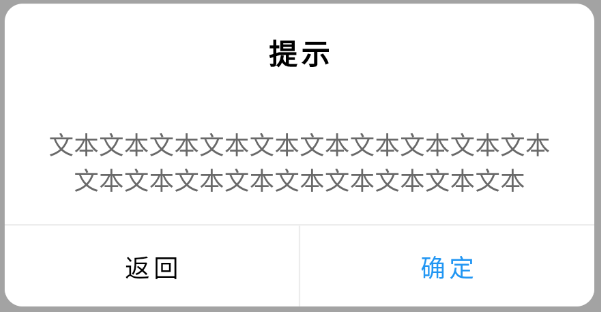

### 关于
component_library 库是为了简化使用某些组件所创，目前还在初步创建中。

### Package使用第三方包:
 
flutter_smart_dialog: ^4.0.2

cached_network_image: ^3.2.0

flutter版本：2.10.5

dart版本：2.16.2

#### 说明
目前package仅暴露出自定义的组件，工具类仅做代码保存，未对外暴露。

### 初始化说明

#### ① FlutterSmartDialog初始化
库中引入了FlutterSmartDialog插件库，为了方便使用且易读，本库直接暴露该插件初始化文件，直接使用FlutterSmartDialog库的初始化方式即可。
###### 示例
```dart
class MyApp extends StatefulWidget {
  const MyApp({Key? key}) : super(key: key);

  @override
  State<MyApp> createState() => _MyAppState();
}

class _MyAppState extends State<MyApp> {
  @override
  Widget build(BuildContext context) {
    return MaterialApp(
      title: 'Flutter Demo',
      theme: ThemeData(
        primarySwatch: Colors.blue,
      ),
      home: const MyHomePage(title: 'Flutter Demo Home Page'),
      navigatorObservers: [
        FlutterSmartDialog.observer,
      ],
      builder: FlutterSmartDialog.init(),
    );
  }
}
```

## 当前组件或效果
#### cl_dialog_util.dart 弹窗工具
    ClDialogUtil.showDialog() 显示弹窗
    ClDialogUtil.showConfirmDialog() 显示文本确定弹窗
    ClDialogUtil.showBottomDialog() 显示底部弹窗

#### cl_app_bar.dart 自定义简化标题栏
#### cl_custom_button.dart 自定义按钮集
    ClElevatedButton() 自定义简化ElevatedButton
    ClOutlineButton() 自定义简化OutlineButton
#### cl_behavior.dart 去除滑动水波效果
#### cl_expansion_tile.dart 自定义ExpansionTile分级列表
#### cl_list_tile.dart 自定义ListTile
#### image_view.dart 自定义图片显示组件，可显示本地图片及网络图片
#### image_text_view.dart 自定义图片+文字组件


## 效果
##### 文本确定弹窗： ClDialogUtil.showConfirmDialog

